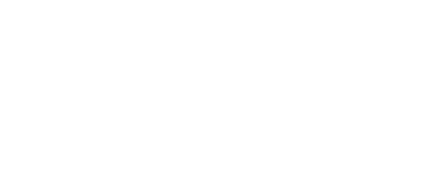
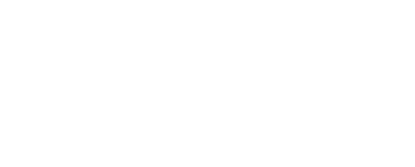

# CBC Time!

---

### Description

Til CBC Time!, får vi udleveret en zip-fil og et link til en web-server.
Vi får desuden en beskrivelse, som beskriver den overordnet arkitektur og funktion af hjemmesiden,
og hvordan den decrypterer og opbevarer data krypteret med AES-kryptering.
Vi får desuden at vide at denne kryptering er self-baked.

> Jeg stoler ikke på såkaldte "cloud-storage-providers", så jeg har lavet min eget service, hvor jeg krypterer mine data med AES-kryptering af militærkvalitet og uploader dem til min hjemmeside, hvor en praktikant derefter dekrypterer dem og opbevarer dataen sikkert!
>
> Cryptogang sagde noget om, at mislykkede dekrypteringer er sårbare over for et "padding-oracle" eller noget, men jeg fiksede det! Og jeg er så sikker på sikkerheden, at jeg endda vil give dig et krypteret flag!

Det sidste paragraf giver os desuden et direkte peg på hvor vi skal lede.
Dekrypteringen kan nemlig lide af sårbarhed overfor "padding-oracle"-angreb.

---

### CBC-Encryption

For at have en idé om den opgave der venter, burde vi se dybbere ind i hvilken sårbarhed serveren lider af.
En hurtig google-søgning vil afsløre, at CBC (Cipher Block Chaining) er betegnelsen for en bestemt form for krypterings-metode,
som er blok-baseret. Basically, er krypteringen delt op i blokke,
hvor hver block bliver XOR'ed med den forrige krypterede block, før de bliver krypteret.



Det præcist omvendte bliver brugt under dekryptering, hvor hver block bliver XOR'ed efter de er blevet ført gennem dekrypteringen.



De fleste former for CBC-kryptering bruger PKCS7-padding.
Altså, hvis den sidste block ikke er af en passende længde, 
bliver den paddet med værdier svarende til antallet af manglende bytes.
Hvis den sidste block er fuldent, bliver der i stedet tilføjet en ny block,
som udelukkende består af padding. Dette skaber et dilemma,
nogle dekrypteringsresultater er teknisk set ukorrekte,
altså de opfylder ikke kravende for PKCS7-padding. 
Hvis denne information videresgives til klienten, 
kan det resultere i en seriøs sårbarhed.

Mere detaljerede kilder kan findes online.

---

### Padding-Oracle attack

Hvis en server videregiver informtion om hvorvidt en dekryptering resulterede i validt plaintext,
er den sårbar overfor det man kalder et padding-oracle angreb.
For at holde dette writeup simpelt, er det et spørgsmål om at udnytte det XOR der sker i dekrypteringen.
Da vi ved hvad den tidligere ciphertext-block er, 
samt at serveren vil give en fejl hvis den endelige dekryptering har inkorrekt padding,
kan man med reglerne for XOR udregne det midterliggende stadie (efter en block er dekrypteret og før den er XOR'ed).
Ud fra det kan man iterativt udregne plaintext-blocken.

En langt bedre og mere detaljeret forklaring kan findes ved dette link:
https://robertheaton.com/2013/07/29/padding-oracle-attack/

---

### Recon

Før vi begynder at exploite, skal vi lige forstå hvordan severen er sat op.
Hvis vi ser på det upload-script som er inkluderet i zip-filen, 
kan vi se at han tilgår et dedikeret endpoint for at uploade det krypterede data til serveren:

```python
TargetUrl = "http://127.0.0.1:13337/submitdata"
```

Det givne URL er selvfølgelig for local host, så vi skal adaptere det til det ip serveren har.
Vi får også givet at flaget er submitted som et json-payload:

```python
resp = requests.post(TargetUrl, data=payload)
```

Alt denne information kan også findes gennem en smule recon på hjemmesiden.
Den vigtige information kan findes i *server.py*.
Her får vi nemlig indsigt i hvordan vores udvikler har *"løst"* problemet med padding-oracle:

```python
# The unpaid intern processes the data, storing it in multiple backup locations to ensure redundancy!
def process(data):
    # Due to danish labour laws, for the purposes of DDC we're simulating the intern's work using a sleep function
    time.sleep(3)
    return

# New and improved padding oracle resistant input handling!
@app.route('/submitflag', methods=['POST'])
def submitflag():
    submitted_ct = request.form['submitted_flag']
    print(f'submitted value is {submitted_ct}')
    try:
        # Decrypt encrypted data
        submitted_pt = aes_cbc_decrypt(submitted_ct, key)
        # Unpaid intern processes data
        process(submitted_pt)
        return send_from_directory('.', 'received.html')
    except:
        ## print("something went wrong, sending error page to user!")
        ## return send_from_directory('.', 'somethingwentwrong.html')
        
        # Cryptogang said telling people when CBC decryptions fail can lead to scary Oracle attacks!!! 
        # So i'll just return the same page whether it worked or not.
        # Take that hackers!!!!
        return send_from_directory('.', 'received.html')
```

Dette er basically det som giver os vores padding-oracle. 
Vi kan nu regne ud, at hvis serveren tager mere end 3 sekunder om at give et svar,
så må vi have fundet en cipher-kode med gyldig padding.

---

### Exploit

For at spare tiden det ville tage at skrive et fuldt exploit-script,
brugte jeg i konkurrencen et github script som jeg fandt her:
https://github.com/mpgn/Padding-oracle-attack

Dette script er sigtet mod en anden request-form end den som vi skal bruge,
så en hurtig adaptering er i sin rette. Ved at udskifte call-funktionen og erstatte nogle af argumenterne med konstanter,
virker scriptet nu med udelukkende vores target. Scriptet kan findes i *exploit.py*,
og hvis vi kalder scriptet med vores flag-cipher, får vi dette output:

```bash
python3 exploit.py -c 81ad7b34d6c4693a96eb5a70ef7aa6af2009c5bffaeed0254caa472466fa18d2b1b1090bf7ac705b86f2afc222e34ba3b8af0fbbda7bd2be2414f9fc77455d39
 
...

[+] Decrypted value (HEX): 4444437B4C33346B795F736964335F6368616E6E656C735F6172655F45564552595748455245217D0808080808080808
[+] Decrypted value (ASCII): DDC{L34ky_sid3_channels_are_EVERYWHERE!}
```

